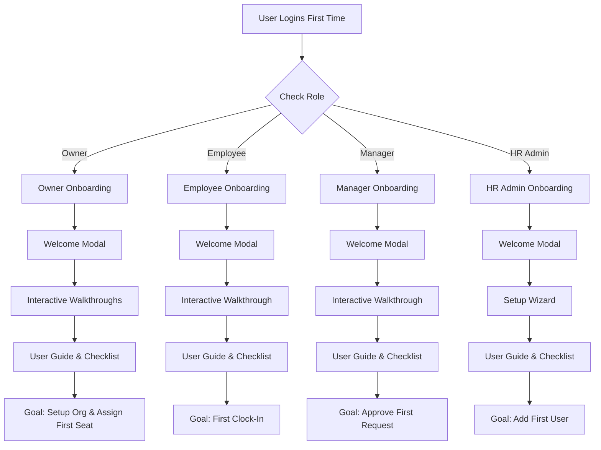

# Kando Onboarding Strategy

This folder contains the complete onboarding strategy for Kando, designed to get new users productive within their first session.

## 📂 Folder Structure

- **[`strategy/`](strategy/)** – Internal documents explaining the *why* and *how* of our onboarding approach.
- **[`guides/`](guides/)** – User-facing step-by-step guides that users see during their onboarding.
- **[`walkthroughs/`](walkthroughs/)** – specific steps for interactive product tours (tooltips & highlights).

## 🎯 Role-Based Onboarding Paths

We have tailored onboarding experiences for four key roles:

| Role | Onboarding Goal | Key Actions | Est. Time |
|------|----------------|-------------|-----------|
| **💳 Owner** | Setup Org & Billing | Complete Profile, Configure Settings, Verify Billing, Assign Seats | ~15 min |
| **👤 Employee** | Clock in & View Schedule | Complete Profile, Clock In, View Schedule, check Leave Balance | ~15 min |
| **👨‍💼 Manager** | Manage Team & Requests | Review Team, Approve Requests, Create Schedule, View Reports | ~20 min |
| **👨‍💻 HR Admin** | Configure System | System Setup, Add Users, Configure Policies, Payroll Setup | ~30 min |

## 🗺️ High-Level Onboarding Flow

## 📚 Quick Links

**Strategy & Principles**
- [Onboarding Principles](strategy/onboarding-principles.md)
- [Owner Strategy](strategy/owner-strategy.md)
- [Employee Strategy](strategy/employee-strategy.md)
- [Manager Strategy](strategy/manager-strategy.md)
- [HR Admin Strategy](strategy/hr-admin-strategy.md)

**User Guides (External)**
- [Owner Onboarding Guide](guides/owner-onboarding-guide.md)
- [Employee Onboarding Guide](guides/employee-onboarding-guide.md)
- [Manager Onboarding Guide](guides/manager-onboarding-guide.md)
- [HR Admin Onboarding Guide](guides/hr-admin-onboarding-guide.md)

**Walkthrough Specs (Dev)**
- [Owner Walkthrough Specs](walkthroughs/owner-walkthrough.md)
- [Employee Walkthrough Specs](walkthroughs/employee-walkthrough.md)
- [Manager Walkthrough Specs](walkthroughs/manager-walkthrough.md)
- [HR Admin Walkthrough Specs](walkthroughs/hr-admin-walkthrough.md)
