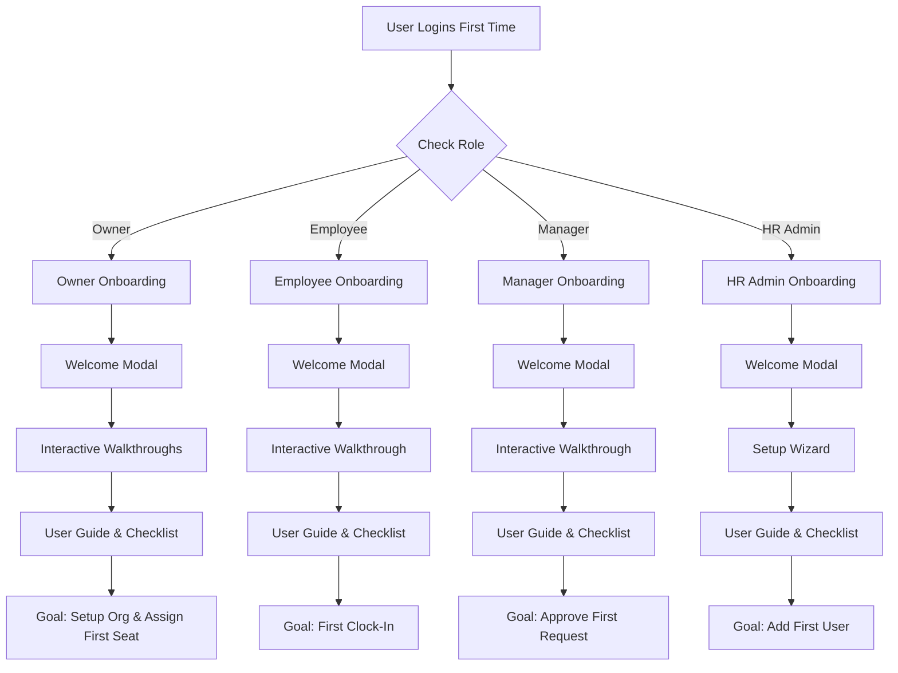

# Kando Onboarding Strategy

This folder contains the complete onboarding strategy for Kando, designed to get new users productive within their first session.

## 📂 Folder Structure

- **[`strategy/`](strategy/)** – Internal documents explaining the *why* and *how* of our onboarding approach.
- **[`guides/`](guides/)** – User-facing step-by-step guides that users see during their onboarding.
- **[`walkthroughs/`](walkthroughs/)** – Specific UI steps for interactive product tours (tooltips & highlights).

---

## 🔑 Key Concept: Owner-First Onboarding

**The Owner role is the foundation of Kando onboarding.**

Owner must complete setup FIRST before any other team members can be added. This is critical:
- **Owner onboards** → Configures organization & assigns seats
- **HR Admin unblocked** → Can now access and create user accounts
- **Managers/Employees unblocked** → Can now login and see role-specific onboarding

**Without Owner completion, the entire organization is blocked.**

## 🎯 Role-Based Onboarding Paths

We have tailored onboarding experiences for four key roles:

| Role | Onboarding Goal | Key Actions | Est. Time |
|------|----------------|-------------|-----------|
| **💳 Owner** | Setup Org & Billing | Complete Profile, Configure Settings, Verify Billing, Assign Seats | ~15 min |
| **👤 Employee** | Clock in & View Schedule | Complete Profile, Clock In, View Schedule, check Leave Balance | ~15 min |
| **👨‍💼 Manager** | Manage Team & Requests | Review Team, Approve Requests, Create Schedule, View Reports | ~20 min |
| **👨‍💻 HR Admin** | Configure System | System Setup, Add Users, Configure Policies, Payroll Setup | ~30 min |

## 🔄 Onboarding Sequence & Dependencies

**Critical Path** (roles must complete in this order):

```
┌─────────────┐
│   OWNER     │  (15 min) Setup org & billing
│ FIRST ROLE  │  Assigns initial seats to HR Admin
└──────┬──────┘
       │
       ↓
┌─────────────┐
│  HR ADMIN   │  (30 min) Creates user accounts
│ SECOND ROLE │  Assigns roles and access groups
└──────┬──────┘
       │
       ├─────────────────────────┐
       ↓                         ↓
┌────────────┐          ┌─────────────┐
│  MANAGERS  │          │  EMPLOYEES  │
│ (20 min)   │          │  (15 min)   │
│ THIRD ROLE │          │ FOURTH ROLE │
└────────────┘          └─────────────┘
```

**Why This Order?**
- Owner creates the organization and assigns the first seat
- HR Admin uses their assigned seat to access and create more users
- Only after users exist can Managers and Employees login
- Each role sees their tailored onboarding experience upon first login

**Success Indicator**: All 4 roles onboard → Full team is productive

## 🗺️ High-Level Onboarding Flow



## 📚 Quick Links

**Strategy & Principles**
- [Onboarding Principles](strategy/onboarding-principles.md) – Core philosophy & success metrics
- [Onboarding Dependencies](strategy/onboarding-dependencies.md) – **Critical sequencing & blocking conditions**
- [Owner Strategy](strategy/owner-strategy.md)
- [Employee Strategy](strategy/employee-strategy.md)
- [Manager Strategy](strategy/manager-strategy.md)
- [HR Admin Strategy](strategy/hr-admin-strategy.md)

**User Guides (External)**
- [Owner Onboarding Guide](guides/owner-onboarding-guide.md)
- [Employee Onboarding Guide](guides/employee-onboarding-guide.md)
- [Manager Onboarding Guide](guides/manager-onboarding-guide.md)
- [HR Admin Onboarding Guide](guides/hr-admin-onboarding-guide.md)

**Walkthrough Specs (Dev)**
- [Owner Walkthrough Specs](walkthroughs/owner-walkthrough.md)
- [Employee Walkthrough Specs](walkthroughs/employee-walkthrough.md)
- [Manager Walkthrough Specs](walkthroughs/manager-walkthrough.md)
- [HR Admin Walkthrough Specs](walkthroughs/hr-admin-walkthrough.md)

---

## ⚠️ Important Notes for Development Team

### Owner Onboarding is Critical Path
- **DO NOT** make Owner onboarding optional or deferrable
- **Owner email verification** must succeed before system is considered "ready"
- **Test Owner flow first** before testing other roles
- **Owner checklist completion** should be tracked as KPI

### Owner-to-HR-Admin Handoff
- Ensure Owner understands they need to assign a seat to HR Admin
- Make this step prominent in Owner walkthrough (Tour 4)
- Consider adding an "Invite HR Admin" button for UX convenience
- Send confirmation email when HR Admin's seat is ready to use

### Access Control Implications
- Owner cannot be fully blocked by any other user
- Owner account creation happens during Signup (not standard user creation)
- Owner role is immutable (cannot be changed)
- If Owner leaves company, only Owner can transfer ownership

### Billing & Verification
- Email verification is NOT optional for Owner
- Failed verification = potential invoice delivery failure
- Implement retry/resend flow clearly (see owner-walkthrough.md)
- Consider SMS backup for billing contact phone

### Monitoring & Alerts
- **Alert if**: Owner hasn't completed profile after 24 hours
- **Alert if**: Billing email remains unverified after 48 hours
- **Alert if**: No seats assigned within 7 days (organization might be inactive)
